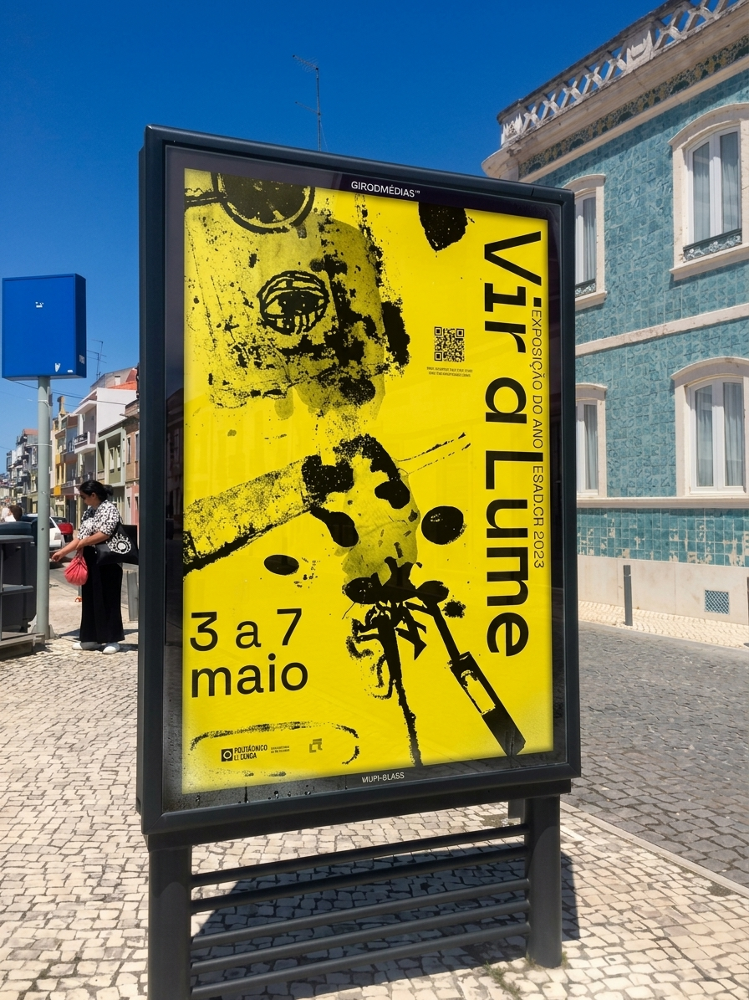

import PdfCarousel from '@components/PdfCarousel.astro';
import Slideshow from '@components/Slideshow.astro';
import Gallery from '@components/Gallery.astro';
import Figure from '@components/Figure.astro';
import Video from '@components/Video.astro';
import Palette from '@components/Palette.astro';
import BeforeAfter from '@components/BeforeAfter.astro';
import Split from '@components/Split.astro';
import Callout from '@components/Callout.astro';
import RepoCard from '@components/RepoCard.astro';
import logo from '../../assets/vira-lume/logo.jpg';
import posters from '../../assets/vira-lume/applications/posters.jpg';
import mupi from '../../assets/vira-lume/applications/mupi1.jpg';

## Brief

A small creative studio needed a cohesive visual identity — something that felt contemporary without chasing trends, and professional without being corporate.

<Figure src={logo} alt="Vira Lume logo" caption="Logótipo principal" maxWidth="800px" />

## Process

<Split image={posters} alt="Provas de tipografia" caption="Testes iniciais em preto e branco">

### Starting with type

A geometric sans-serif with a good weight range and strong numerals set the tone for everything else.

Os testes fizeram-se primeiro em preto e branco, para o carácter da fonte não depender da cor.

</Split>

<Split image={mupi} alt="Provas de cor" caption="Mupi com a paleta final" reverse>

### Then colour

A near-black background, one strong accent and a small set of neutral greys. Enough hierarchy, not enough to become chaotic.

</Split>

<Callout type="idea">
Começar pela tipografia e só depois pela cor evitou decidir o carácter da marca com base numa paleta bonita.
</Callout>
<Callout type="idea">Usa as cores do tipo.</Callout>

<Callout type="warning" bg="#2a1a14">Só muda o fundo.</Callout>

<Callout type="note" color="#e8553d" bg="#e8553d1f" title="Brasa">
  Cor de destaque e fundo à tua escolha.
</Callout>

<Callout title="">Sem título.</Callout>

## Colours

<Palette
  colors={[
    { name: 'Carvão', hex: '#b0b9bb' },
    { name: 'Amarelo', hex: '#ffee5b' },
    { name: 'Roxo', hex: '#7960b1' },
  ]}
/>

## Redesign

<BeforeAfter before={posters} after={mupi} alt="Poster" ratio="16 / 10" maxWidth="800px" />

## Booklet

<PdfCarousel src="/vira-lume/BOOKLETFINAL.pdf" />

## Flyers

<Slideshow
  alt="Flyer Vira Lume"
  maxWidth="800px"
  images={[
    '/vira-lume/FLYER_FINAL_IMPRIMIR-1-1.jpg',
    '/vira-lume/FLYER_FINAL_IMPRIMIR-1-2.jpg',
    '/vira-lume/FLYER_FINAL_IMPRIMIR-2-1.jpg',
    '/vira-lume/FLYER_FINAL_IMPRIMIR-2-2.jpg',
  ]}
/>

## Applications

<Gallery folder="vira-lume/applications" columns={3} alt="Vira Lume application" />

## Motion

<Video src="https://www.youtube.com/watch?v=3ZMBM1mkVQ0" loop maxWidth="800px" />

## Tooling

O sistema de cores foi exportado como variáveis CSS:

```css title="tokens.css"
:root {
  --charcoal: #1a1a1a;
  --paper: #f2efe8;
  --ember: #e8553d;
}
```

<Callout type="warning" title="Contraste">
O laranja sobre o papel não passa AA para texto pequeno. Usa-o só em títulos e elementos gráficos.
</Callout>

<RepoCard repo="kastico/kastico.github.io" />

## Reflection

Brand work is humbling. You spend weeks on something that looks deceptively simple. That simplicity is the whole point — and it's much harder to achieve than complexity.

---

## Referência: o que o Astro faz sozinho

Tudo daqui para baixo é Markdown puro, sem imports.

### Texto

Texto normal com **negrito**, *itálico*, ***os dois***, ~~riscado~~ e `código inline`. Aspas "retas" e travessões -- viram tipografia correta (SmartyPants). Um link [para o GitHub](https://github.com/kastico) e um URL solto: https://bunker-labs.dev

### Listas

- Primeiro item
- Segundo item
  - Sub-item
  - Outro sub-item
- Terceiro item

1. Passo um
2. Passo dois
3. Passo três

- [x] Logótipo
- [x] Paleta
- [ ] Guia de aplicação

### Tabela

| Entregável | Formato | Estado |
|:---|:---:|---:|
| Logótipo | SVG | Feito |
| Guia de tipografia | PDF | Feito |
| Biblioteca de componentes | Figma | Em curso |

### Callout em Markdown

> **Nota**
>
> Um blockquote com o título num parágrafo só dele fica igual ao componente `Callout` do tipo `note`.

### Imagens do Markdown


*Legenda numa linha em itálico, colada à imagem*

### Código com várias linguagens

```cpp title="main.cpp"
#include <QGuiApplication>

int main(int argc, char *argv[]) {
    QGuiApplication app(argc, argv);
    return app.exec();
}
```

```qml title="Button.qml"
Rectangle {
    width: 120; height: 40
    color: mouse.pressed ? "#e8553d" : "#1a1a1a"
    MouseArea { id: mouse; anchors.fill: parent }
}
```

```bash
npm run dev
```

### Notas de rodapé

O sistema de cores tem quatro tons[^1] e a tipografia três pesos[^2].

[^1]: Carvão, papel, brasa e pinheiro.
[^2]: Regular, médio e negrito.

### HTML cru

<details>
<summary>Mostrar detalhes técnicos</summary>

Conteúdo escondido que abre ao clicar. Aceita **Markdown** lá dentro, desde que haja linhas em branco à volta.

</details>

Atalhos com <kbd>Ctrl</kbd> + <kbd>K</kbd>, texto <mark>marcado</mark> e H<sub>2</sub>O ou E = mc<sup>2</sup>.

